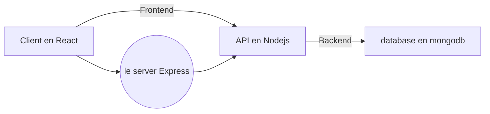

# Groupe de daniel_t 899672

## Configuration de l'environement et installation des divers outils nécessaire.

Pour ce projet de création d'une API vous aurez besoin de plusieurs outils.

Node js, qui vous permetra d'avoir npm d'installer.

```sh
"https://nodejs.org/en/download/"
```

Mongodb qui sera votre base de donnée NO-SQL.

```sh
"https://www.mongodb.com/try/download/community"
```

MongoDB Compass qui est une interface visuel de vos bases de données

```sh
"https://www.mongodb.com/try/download/community"
```

Postman qui vous permettra de tester les différents endpoints de notre API sans avoir besoin de passer par le Front-end.

```sh
"https://www.postman.com/downloads/"
```

Vous devrez ensuite cloner le repository GIT du projet:

```sh
"https://rendu-git.etna-alternance.net/module-8433/activity-45935/group-899672"
```

Une fois le dossier cloner, vous y trouverez 2 dossiers;
-Client (ce qui corespond à la partie Front-end de notre application web développer en _Javascript_ grâce au framework **Reactjs**).
-Server (qui contiend notre API développer en _Javascript_ grâce à **Nodejs**).

On a presque fini !
Vous devrez vérifier que nodejs s'est bien installer, pour cela, vous devrez executer la commande :

```sh
node --version
```

Vous devrez ensuite installer dans le dossier client et server les différentes dépendances nécessaire à l'execution du projet grâce à la commande:

```sh
npm install
```

qui viendra installer le dossier nodejs qui aura toutes les extensions indiquer dans nos fichiers de configuration "package.json".
L'installation est désormais terminée !!

Vous pourez alors lancer la commande ["npm start"] dans le dossier client et le dossier server

## Architecture de notre projet

Voici un shema montrant les connexions entre les différents services.



Vous pouvez observez 2 networks:

- Le **Frontend** qui relie notre client à l'API.
- Le **Backend** qui permet à l'API de faire des requetes sur notre database.

## Le thème de notre site Web

Nous avons choisi de créer un site mettant en avant des boutiques de _Taxidermie_, les founisseurs et évidemment les animaux empaillés.

## Les différents outils et librairies utilisés:

#### Firebase:

Nous avons choisi pour notre authentification de passer par _Firebase_ qui permet de générer les tokens d'authentification que nous pourrons exploiter en Back-end et les mails automatique pour confirmer son compte, réinitialisation des mots de passe, différents moyens de s'authentifier hors mail comme par gmail, facebook etc.

#### Redux:

Nous l'utilisons afin de "contenairiser" la donnée venant de _firebase_ par le Front afin de l'utiliser en Back-end pour l'ajouter dans notre base de donnée.

#### Mongoose:

Mongoose nous permets d'exploiter plusieurs concepte utile pour la construction et structure de l'architecture de notre _database_ grâce au Shémas utiliser dans nos modèle. Notre **API** respecte le principe du MVC "Modèles, Vues, Controllers".

---

Pour ce qui concerne le fonctionnement de l'**API** je vous invite à consulter notre documentation **Postman** expliquant les différents _endpoint_ CRUD.

Vous pouvez importez sur **Postman** notre collection qui se trouve dans la racine du dépot sous le nom de _Taxidermie.postman_collection.json_ à côté de ce _Readme_, du dossier _client_ et _server_.
